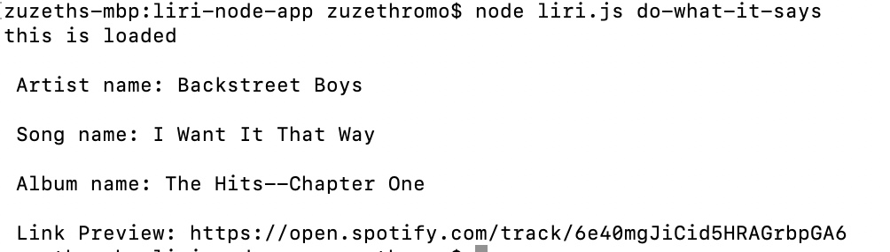
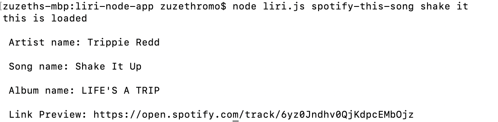
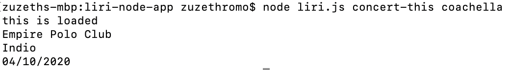

Objective:

Liri is a Command Line app
Liri retrieves data from Spotify, BandsInTown, and other API per command line

How to Use:

1. File path to Liri folder 

2. Enter node liri.js do-what-it-says
    - this will read the random text file
    

3. Enter node liri.js spotify-this-song 'song name'
    - this will return song details including song name, album, and preview link
    
 

4. Enter node liri.js concert-this 'concert name'
    -this will venue name, city, etc
    

Built with:

-Javascript
-Node.js
-Axios
-Moment.js
